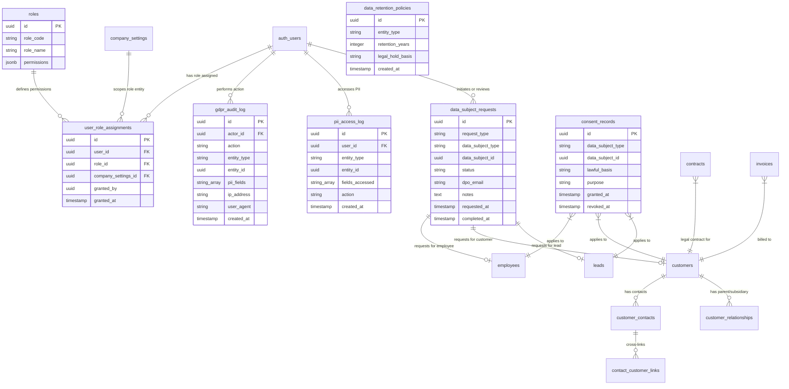
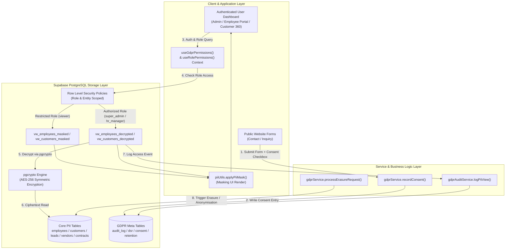

# GDPR Compliance Implementation Plan for KDADKS

## User Decisions Captured (2026-08-21)

- ✅ **Role assignment UI** (not seeded roles) — integrated with existing RBAC framework (`036_role_based_access_control.sql`)
- ✅ **Anonymisation for legal records** (replace PII with `[DELETED]`, retain financial records, invoices, salary slips, TDS reports & contracts)
- ✅ **Retention periods**: Leads 3yr · Customer/Invoice 7yr · Employee 7yr · Contact forms 1yr · Policies/Board Resolutions 10yr
- ✅ **DPO email**: `contact@kdadks.com`
- ✅ **Existing contracts/employment agreements** = sufficient lawful basis for existing data
- ✅ **pgcrypto encryption at rest** for Aadhaar, bank account numbers, IFSC, PAN, UAN, ESIC

---

## Executive Summary & Current State

KDADKS currently has authenticated-user RLS policies (`USING (true)`) on all tables — every authenticated user can read/write every row regardless of role. PII data (names, emails, phones, DOB, Aadhaar, PAN, bank account numbers, B2B contact cross-links, contract signatures, etc.) flows across 40+ tables with no data-minimisation, no consent tracking, no right-to-erasure mechanism, and no granular audit trail beyond the `employee_audit_logs` and `role_audit_logs` tables.

This plan brings the entire KDADKS application (Admin Dashboard, CRM Pipeline, Customer 360° Hub, B2B Hierarchy, Invoicing, HR & Operations, Employee Self-Service Portal, and Governance) into GDPR Article compliance with zero functional regression.

---

## GDPR Articles Addressed

| Article | Requirement | Gap in Current System | Implementation Mechanism |
| --- | --- | --- | --- |
| **Art. 5** | Data minimisation & purpose limitation | No PII classification or field-level minimisation | Column masking views (`vw_*_masked`) + `piiUtils.applyPiiMask()` |
| **Art. 6** | Lawful basis for processing | No consent/lawful-basis records stored | `consent_records` table with contract/consent/legitimate_interest tracking |
| **Art. 7** | Consent management | No explicit consent tracking on public/lead forms | Consent checkboxes on public forms (`Contact`, `BookConsultation`, `ServiceInquiry`) |
| **Art. 13/14** | Privacy notices | Privacy Policy page exists but not linked to data entry | Mandatory privacy notices & consent logging on all data ingestion points |
| **Art. 17** | Right to erasure (RTbF) | No erasure workflow or PII redaction | `fn_gdpr_anonymise_employee` / `customer` replacing PII with `[DELETED]` |
| **Art. 20** | Right to portability | No export mechanism for data subjects | `fn_gdpr_export_employee` / `customer` returning complete JSON data package |
| **Art. 22** | RBAC / access controls | All authenticated users have full DB read/write | RBAC system (migrations 036 + 039) with granular role scoping |
| **Art. 30** | Records of processing | No processing register or data map | `gdpr_audit_log` & `data_retention_policies` tables |
| **Art. 32** | Security of processing | PII stored in plaintext (Aadhaar, bank details) | `pgcrypto` AES-256 encryption at rest with decryption views |
| **Art. 33/34** | Breach notification | No breach audit trail or notification workflow | Real-time `pii_access_log` & automated DPO breach alert triggers |

---

## Comprehensive PII Inventory (40+ Tables → Fields)

| Domain | Table | PII Fields / Sensitive Attributes | Encryption & Protection |
| --- | --- | --- | --- |
| **HR & Payroll** | `employees` | `first_name`, `last_name`, `full_name`, `fathers_name`, `email`, `phone`, `date_of_birth`, `gender`, `address_*`, `pan_number`, `aadhar_number`, `uan_number`, `esic_number`, `bank_name`, `bank_account_number`, `bank_ifsc_code` | `pgcrypto` ciphertext for Aadhaar, bank, PAN, IFSC, UAN, ESIC. Decrypted in `vw_employees_decrypted`. |
| **HR & Payroll** | `salary_slips` | `email_sent_to` (employee email), net salary, tax details | Audit logged on email dispatch |
| **HR & Payroll** | `employment_documents` | `document_data` JSONB (contains employee PAN, passport, bank details) | Restricted to `super_admin` / `hr_manager` |
| **HR & Payroll** | `full_final_settlements` | `employee_name`, `designation` (denormalised) | Anonymised on erasure request |
| **HR & Payroll** | `employee_compensation` | `base_salary`, `allowances`, `bank_account` | Encrypted bank fields |
| **HR & Payroll** | `employee_notes` | `note_text` (contains HR assessment notes) | Access logged |
| **HR & Operations** | `leave_requests` | `reason`, `contact_during_leave` | Minimised view |
| **HR & Operations** | `attendance_records` | `ip_address`, `location_data`, `check_in_notes` | Audit logged on report export |
| **CRM & Sales** | `customers` | `company_name`, `contact_person`, `email`, `phone`, `address_*`, `gstin`, `pan` | Masked for viewer role (`vw_customers_masked`) |
| **CRM & Sales** | `customer_contacts` | `name`, `email`, `phone`, `job_title` | Masked for viewer role |
| **CRM & Sales** | `customer_relationships` | `from_customer_id`, `to_customer_id`, relationship type | Included in Portability export |
| **CRM & Sales** | `contact_customer_links` | `contact_id`, `customer_id`, `role_title`, `email`, `phone` | Cross-company contact link protection |
| **CRM & Sales** | `leads` | `first_name`, `last_name`, `email`, `phone`, `job_title`, `company_name`, `address_*`, `gstin`, `pan`, `vat_number`, `cro_number` | Consent checked on creation |
| **CRM & Sales** | `opportunities` | `primary_contact_name`, `primary_contact_email` | Link to lead/customer audit |
| **CRM & Sales** | `lead_activities` | `notes`, `created_by_name` | Activity timeline audit |
| **CRM & Sales** | `lead_follow_up_tasks` | `assigned_to`, `notes`, `completion_notes` | Task audit logging |
| **Finance & Billing** | `vendors` | `contact_person`, `email`, `phone`, `address`, `gstin`, `pan`, `bank_account`, `bank_ifsc` | `pgcrypto` encrypted bank data (`vw_vendors_decrypted`) |
| **Finance & Billing** | `invoices` | Customer email, contact person, billing address | Anonymised PII on erasure, retain financial totals |
| **Finance & Billing** | `expenses` | `claimed_by` link to employees, receipt URLs | Financial retention (7yr) |
| **Finance & Billing** | `payments` | `payment_reference` (banking details), payer email | Financial retention (7yr) |
| **Finance & Billing** | `subscriptions` | `billing_email`, customer billing address | Billing audit log |
| **Governance & Legal**| `contracts` | `party_a_vat_number`, `party_a_cro_number`, `party_b_vat_number`, `party_b_cro_number`, `signatory_name`, `signatory_email`, `signatory_phone` | Anonymised PII on erasure, retain legal contract ID |
| **Governance & Legal**| `policies` | `created_by`, `approved_by`, `document_content` | 10yr policy retention |
| **Governance & Legal**| `board_resolutions` | `director_name`, `signatory_name`, `din_number` | Legal retention (10yr) |
| **System & Security** | `user_role_assignments`| Supabase `user_id` mapping, granted_by | Scope-filtered RBAC |
| **System & Security** | `role_audit_logs` | RBAC modification timeline, actor IP | Immutable audit trail |

---

## Enterprise Architecture & Data Model Diagrams

### 1. Enterprise GDPR Entity-Relationship Data Model (ERD)



---

### 2. End-to-End Enterprise Data Flow & Access Architecture



---

### 3. Data Subject Request (DSR) & Right-to-Erasure Workflow

```mermaid
flowchart TD
    Start (["Data Subject Request Initiated<br/>(Erasure / Portability / Access)"]) --> LogReq ["Log Request in data_subject_requests<br/>Status: pending"]
    LogReq --> DpoNotify ["Auto-notify DPO Email<br/>contact@kdadks.com"]
    DpoNotify --> DpoReview {"DPO Review & Validation<br/>Status: in_review"}

    DpoReview -->|"Rejected"| Reject (["Update Status: rejected<br/>Notify Data Subject"])

    DpoReview -->|"Approved"| ReqType {"Evaluate Request Type"}

    ReqType -->|"Portability (Art. 20)"| ExecPort ["Call fn_gdpr_export_employee() / customer()"]
    ExecPort --> GenJson ["Generate Sealed JSON Package<br/>(Includes Profile, B2B Links, Contracts, Invoices)"]
    GenJson --> CompletePort (["Update Status: completed<br/>Deliver Secure Download"])

    ReqType -->|"Erasure (Art. 17)"| CheckLegal {"Check Legal Hold & Retention<br/>(Invoices / Payroll / Taxes / Contracts = 7 Years)"}

    CheckLegal -->|"Active Financial / Legal Record"| RedactPII ["Execute Partial Erasure<br/>fn_gdpr_anonymise_employee/customer"]
    CheckLegal -->|"No Legal Hold"| FullAnonymise ["Execute Full Anonymisation"]

    RedactPII --> AnonymiseFields ["Replace PII (Name, Email, Phone, Aadhaar, Signatures) with [DELETED]<br/>Retain Financial Invoice/Payment/Contract IDs"]
    FullAnonymise --> AnonymiseFields

    AnonymiseFields --> AuditErasure ["Log Event in gdpr_audit_log<br/>(Actor, Entity, Timestamp)"]
    AuditErasure --> CompleteErasure (["Update Status: completed<br/>Notify Data Subject"])
```

---

### 4. Security & Encryption at Rest Architecture

```mermaid
graph LR
    subgraph RawData ["Plaintext Input"]
        InPii ["Aadhaar: 1234-5678-9012<br/>Bank Account: 9876543210<br/>PAN: ABCDE1234F"]
    end

    subgraph WritePipeline ["Encryption on Ingestion"]
        EncryptFn ["encrypt_pii(value, secret_key)<br/>pgcrypto AES-256"]
        DbStore [("DB Storage Column<br/>Ciphertext String")]
    end

    subgraph ReadPipeline ["Access & Decryption Pipeline"]
        RlsCheck {"Role Authorization Check"}
        DecryptFn ["decrypt_pii(column, secret_key)"]
        MaskingFn ["piiUtils.applyPiiMask()"]
    end

    subgraph Presentation ["UI Rendering"]
        DecryptedView ["Full PII View<br/>(1234-5678-9012)"]
        EncryptedLabel ["Protected View<br/>([encrypted])"]
        MaskedView ["Masked View<br/>(XXXX-XXXX-9012)"]
    end

    InPii --> EncryptFn
    EncryptFn --> DbStore

    DbStore --> RlsCheck
    RlsCheck -->|"Super Admin / HR Manager"| DecryptFn
    DecryptFn --> DecryptedView

    RlsCheck -->|"Viewer / Unauthorized"| EncryptedLabel
    RlsCheck -->|"Partial Permissions"| MaskingFn
    MaskingFn --> MaskedView
```

---

## Proposed Changes & Components

### Component 1 — Database Migrations

#### `038_gdpr_encryption.sql` *(Sequential after migration 037)*
- Enable `pgcrypto` PostgreSQL extension.
- Encryption & decryption helper functions (`encrypt_pii`, `decrypt_pii`) for sensitive columns (Aadhaar, bank account numbers, IFSC, PAN, UAN, ESIC).
- Database triggers to automatically encrypt sensitive columns on insert/update.
- Decrypted database views (`vw_employees_decrypted`, `vw_vendors_decrypted`, `vw_customers_decrypted`) restricted to authorized roles.
- Data migration script to encrypt existing plaintext sensitive records.

#### `039_gdpr_compliance.sql` *(Sequential after migration 038)*
- **`gdpr_roles` & integration with `036_role_based_access_control.sql`**: maps GDPR roles (`super_admin`, `hr_manager`, `finance_manager`, `sales_manager`, `viewer`, `employee_self`) into system `roles` and `user_role_assignments` tables.
- **`gdpr_audit_log` table**: unified cross-domain PII audit trail (`actor`, `action`, `entity_type`, `entity_id`, `pii_fields_accessed`, `ip_address`, `user_agent`, `timestamp`).
- **`data_subject_requests` table**: tracks GDPR requests (access / erasure / portability / rectification / restriction) with status workflow.
- **`consent_records` table**: records consent per data subject (employee / customer / lead), lawful basis, purpose, granted/revoked dates.
- **`data_retention_policies` table**: configurable retention rules per entity type.
- **`pii_access_log` table**: tracks when sensitive fields (Aadhaar, bank account, PAN) are accessed or exported.
- **Updated RLS Policies**: replace `USING (true)` with role-aware policies:
  - HR tables: only `super_admin` + `hr_manager` can read sensitive fields.
  - Finance tables: only `super_admin` + `finance_manager`.
  - Customer/Lead tables: `super_admin` + `sales_manager` + `finance_manager`.
  - Employees via `employee_self` role can only access their own records.
- **PostgreSQL Anonymisation & Portability Functions**:
  - `fn_gdpr_anonymise_employee(employee_id)` — redacts PII for erasure requests (sets encrypted fields to `encrypt_pii('[DELETED]')`, name to `[DELETED]`, email to `deleted_<uuid>@deleted.local`).
  - `fn_gdpr_anonymise_customer(customer_id)` — anonymises customer PII while retaining financial/invoice audit records.
  - `fn_gdpr_export_employee(employee_id)` — returns JSON package of all employee data (portability).
  - `fn_gdpr_export_customer(customer_id)` — returns JSON package of all customer data (includes profile, B2B relationships, contact links, quotes, contracts, invoices).
  - `fn_log_pii_access(user_id, entity_type, entity_id, fields[], action)` — helper called by triggers.
- **Column Masking Views**: `vw_employees_masked`, `vw_customers_masked` returning `'***'` for sensitive fields for `viewer` role.

---

### Component 2 — TypeScript Types & Utility Configurations

#### `src/types/gdpr.ts`
```typescript
export type GdprRole = 'super_admin' | 'hr_manager' | 'finance_manager' | 'sales_manager' | 'viewer' | 'employee_self';
export type GdprRequestType = 'access' | 'erasure' | 'portability' | 'rectification' | 'restriction';
export type GdprRequestStatus = 'pending' | 'in_review' | 'completed' | 'rejected' | 'partially_completed';
export type LawfulBasis = 'consent' | 'contract' | 'legal_obligation' | 'vital_interests' | 'public_task' | 'legitimate_interests';

export interface UserRole {
  id: string;
  user_id: string;
  role: GdprRole;
  company_settings_id?: string;
  granted_by: string;
  granted_at: string;
}

export interface GdprAuditLog {
  id: string;
  actor_id: string;
  action: string;
  entity_type: string;
  entity_id: string;
  pii_fields: string[];
  ip_address?: string;
  user_agent?: string;
  created_at: string;
}

export interface DataSubjectRequest {
  id: string;
  request_type: GdprRequestType;
  data_subject_type: 'employee' | 'customer' | 'lead';
  data_subject_id: string;
  status: GdprRequestStatus;
  dpo_email: string;
  notes?: string;
  requested_at: string;
  completed_at?: string;
}

export interface ConsentRecord {
  id: string;
  data_subject_type: 'employee' | 'customer' | 'lead';
  data_subject_id: string;
  lawful_basis: LawfulBasis;
  purpose: string;
  granted_at: string;
  revoked_at?: string;
}

export interface DataRetentionPolicy {
  id: string;
  entity_type: string;
  retention_years: number;
  legal_hold_basis?: string;
  created_at: string;
}

export interface PiiAccessLog {
  id: string;
  user_id: string;
  entity_type: string;
  entity_id: string;
  fields_accessed: string[];
  action: string;
  created_at: string;
}
```

#### `src/utils/encryptionUtils.ts`
```typescript
export const ENCRYPTED_FIELDS: Record<string, string[]> = {
  employees: ['aadhar_number', 'bank_account_number', 'bank_ifsc_code', 'pan_number', 'uan_number', 'esic_number'],
  vendors: ['bank_account', 'bank_ifsc', 'pan', 'gstin'],
  customers: ['pan', 'gstin'],
  leads: ['pan', 'gstin', 'vat_number', 'cro_number'],
  contracts: ['party_a_vat_number', 'party_a_cro_number', 'party_b_vat_number', 'party_b_cro_number']
};

export const isEncryptedField = (table: string, field: string): boolean => {
  return ENCRYPTED_FIELDS[table]?.includes(field) ?? false;
};

export const PII_DECRYPTION_VIEWS: Record<string, string> = {
  employees: 'vw_employees_decrypted',
  vendors: 'vw_vendors_decrypted',
  customers: 'vw_customers_decrypted',
};
```

---

### Component 3 — GDPR Services

#### `src/services/gdprService.ts`
- `getUserRole(userId)` — fetch current user's GDPR role.
- `assignRole(userId, role, companySettingsId)` — assign a role via Admin UI.
- `getAllUsersWithRoles()` — list all Supabase users with their assigned roles (for Role Assignment UI).
- `revokeRole(userRoleId)` — remove a role assignment.
- `hasPermission(userId, permission)` — RBAC check helper.
- `logPiiAccess(entityType, entityId, fields, action)` — creates `pii_access_log` entry.
- `createDataSubjectRequest(...)` — initiate DSR (auto-notifies `contact@kdadks.com`).
- `getDataSubjectRequests(filters)` — list DSRs with pagination & filtering.
- `processErasureRequest(requestId)` — calls `fn_gdpr_anonymise_employee` or `fn_gdpr_anonymise_customer`.
- `exportDataSubjectData(requestId)` — calls portability functions and triggers JSON download.
- `recordConsent(...)` — upserts `consent_records`.
- `revokeConsent(consentId)` — marks consent revoked.
- `getConsentStatus(entityType, entityId)` — checks current consent state.
- `getRetentionPolicies()` / `updateRetentionPolicy(id, years)` — manage data retention policies.

#### `src/services/gdprAuditService.ts`
- Universal audit logging for all PII entities (customers, leads, vendors, employees, contracts, policies, board resolutions). Extends `auditLogService.ts` & `contractAuditService.ts` across all domains.
- `logCreate(entityType, entityId, data, userId)`
- `logUpdate(entityType, entityId, changes, userId)`
- `logDelete(entityType, entityId, userId)`
- `logPiiView(entityType, entityId, fields, userId)` — called when sensitive fields are viewed or decrypted.
- `getAuditTrail(entityType?, entityId?, dateRange?, userId?)` — cross-domain audit query with pagination.

---

### Component 4 — RBAC Context & Permission Hooks

#### `src/contexts/GdprContext.tsx`
- Wraps application with current user's GDPR role.
- Exposes `userRole`, `hasPermission(permission)`, `canAccessPii(entityType)`, `canDecryptField(table, field)`.
- Loaded once on authentication, cached for the session.

#### `src/hooks/useGdprPermissions.ts`
- `useGdprPermissions()` returns:
  `{ canViewPii, canEditPii, canDeletePii, canExportData, canDecryptFields, isHrManager, isFinanceManager, isSalesManager, isSuperAdmin }`
- Combines seamlessly with `useRolePermissions.ts` for unified operational & security permission checks across all 26 application modules.

---

### Component 5 — PII Masking Utility

#### `src/utils/piiUtils.ts`
- `maskEmail(email)` → `j***@example.com`
- `maskPhone(phone)` → `+91 98***1234`
- `maskAadhaar(aadhaar)` → `XXXX-XXXX-1234`
- `maskPan(pan)` → `ABCDE****F`
- `maskBankAccount(account)` → `XXXX1234`
- `maskName(name)` → `J*** D***`
- `applyPiiMask(value, fieldType, canViewPii)` — single entry point used across components.
- `isEncryptedAndMasked(table, field, userRole)` — determines if a field displays as `[encrypted]` vs decrypted value.

---

### Component 6 — Admin UI: GDPR Compliance Dashboard

#### `src/components/admin/GdprComplianceDashboard.tsx`
Admin view (route: `/admin/gdpr`) with 6 tabs:
1. **Audit Trail** — searchable/filterable cross-domain audit log table (all PII accesses & changes, who decrypted what field, when).
2. **Data Subject Requests** — list/manage DSRs with status workflow buttons (`in_review` → `completed`/`rejected`). Notifications sent to `contact@kdadks.com`.
3. **Consent Management** — view consent records per employee/customer; existing records default to `contract` / `legitimate_interests`.
4. **User Role Management** — full RBAC role assignment UI listing all Supabase auth users, enabling assignment/revocation of `super_admin`, `hr_manager`, `finance_manager`, `sales_manager`, `viewer` roles per scope.
5. **Retention Policies** — view/edit retention rules:
   - Leads: 3 years
   - Customers / Invoices / Contracts: 7 years
   - Employees / Payroll / TDS: 7 years
   - Contact forms: 1 year
   - Governance Policies & Board Resolutions: 10 years
6. **Data Export & Erasure** — trigger portability export for any data subject (downloads JSON); execute erasure requests with legal-hold awareness.

#### `src/components/admin/SimpleAdminDashboard.tsx`
- Add GDPR Compliance route (`/admin/gdpr`) to sidebar under Governance section with shield icon.
- Wrap application root with `GdprContext.Provider`.

---

### Component 7 — Public Form Consent Collection

- `src/components/public pages/Contact.tsx`
- `src/components/public pages/BookConsultation.tsx`
- `src/components/public pages/ServiceInquiry.tsx`
- Add GDPR consent checkbox: *"I consent to Kdadks processing my personal data in accordance with the Privacy Policy."*
- Store consent in `consent_records` table with `lawful_basis = 'consent'`.
- Submissions require consent checkbox to be checked.
- Form data auto-flagged for retention/deletion after 1 year.

---

### Component 8 — Employee Portal: PII Rights

#### `src/components/employee/GdprRights.tsx`
- **"My Data"** tab in employee portal showing stored data categories without revealing raw encrypted values.
- **"Download My Data"** button (portability export via `fn_gdpr_export_employee`).
- **"Data Correction Request"** form creating `data_subject_request` of type `rectification` (notifies `contact@kdadks.com`).
- Link added to `EmployeeLayout.tsx` sidebar.

---

### Component 9 — Component PII Field Masking

Conditionally apply `applyPiiMask()` and `isEncryptedAndMasked()` based on `useGdprPermissions()` across existing views:
- `src/components/hr/EmploymentDocuments.tsx`: `pan_number`, `aadhar_number`, `bank_account_number` displayed as `[encrypted]` for non-HR/non-admin roles; decrypted from `vw_employees_decrypted` for authorised roles.
- `src/components/contract/ContractManagement.tsx`: Signatory PII and VAT/CRO numbers masked for unauthorized roles.
- `src/components/customer/Customer360Hub.tsx`: Contact network details and cross-links masked for `viewer` role.
- `src/components/invoice/InvoiceManagement.tsx`: Customer email, phone, PAN masked in list views for `viewer` role.
- `src/components/lead/LeadManagement.tsx`: Lead email, phone, PAN, VAT number masked for `viewer` role.
- `src/components/customer/CustomerManagement.tsx`: Email, phone, PAN masked in list views for `viewer` role.
- `src/components/admin/FinanceManagement.tsx`, `IncomeManagement.tsx`, `ExpenseManagement.tsx`: Vendor bank account & IFSC shown as `[encrypted]` for non-finance roles; decrypted from `vw_vendors_decrypted` for `finance_manager`/`super_admin`.
- `src/components/hr/AttendanceManagement.tsx` & `src/components/admin/PerformanceFeedback.tsx`: Employee name/email access logged to `gdpr_audit_log` when reports are exported.

---

### Component 10 — Service Layer Audit Integration

- `src/services/invoiceService.ts`: Log CRUD via `gdprAuditService`. Switch customer PAN/GSTIN reads to `vw_customers_decrypted` for authorised roles.
- `src/services/contractService.ts`: Log CRUD via `gdprAuditService`. Switch contract signatory reads to decrypted view.
- `src/services/leadService.ts`: Log CRUD via `gdprAuditService`. Switch PAN/GSTIN/VAT reads to decrypted view.
- `src/services/employeeService.ts`: Log CRUD via `gdprAuditService`. Switch sensitive reads to `vw_employees_decrypted`.
- `src/services/expenseService.ts`: Log vendor CRUD via `gdprAuditService`. Switch vendor bank reads to `vw_vendors_decrypted`.

---

## Decisions Confirmed & Architectural Notes

1. **RBAC Role Assignment**: Admin users will be assigned roles dynamically through the Role Assignment UI in `/admin/gdpr`. Existing admin users will be assigned `super_admin` by default during migration for zero disruption.
2. **Aadhaar & Sensitive Data Encryption**: Stored as ciphertext encrypted at rest using PostgreSQL `pgcrypto`. Decryption is restricted to authorised database views (`vw_employees_decrypted`) accessible only by permitted roles.
3. **Right to Erasure vs Legal Retention**: Financial records, invoices, salary slips, contracts, and TDS data are retained for 7 years under statutory obligations. Erasure requests redact PII (replacing fields with `[DELETED]`) while preserving financial transaction structures.
4. **No Functional Regression**: All existing workflows (Invoice PDF generation, Contract PDF generation, salary slip email delivery, Lead → Opportunity → Quote → Invoice pipeline) remain intact for `super_admin` users.

---

## Verification Plan

### Automated Tests
```bash
npm run lint    # Ensure no TypeScript or linting errors
npm run build   # Verify full TypeScript compilation succeeds
```

### Manual Verification
1. **Super Admin Access**: Log in as `super_admin` — verify all PII is visible (decrypted) and audit logs populate.
2. **Viewer Role Masking**: Assign `viewer` role to a test user via GDPR Dashboard → verify sensitive fields are masked across list views and encrypted fields show `[encrypted]`.
3. **Encryption at Rest**: Inspect database directly — verify Aadhaar and bank account fields are stored as ciphertext.
4. **Public Form Consent**: Submit contact form → verify new row created in `consent_records`.
5. **Right to Erasure**: Execute an erasure request from GDPR dashboard → verify PII is anonymised to `[DELETED]` while keeping financial and contract records intact.
6. **Data Portability**: Trigger data export → verify JSON download contains complete data subject history (profile, B2B links, contracts, invoices) in readable form.
7. **Cross-Domain Audit Trail**: Perform CRUD operations across Leads, Customers, Vendors, Contracts, and Employees → verify entries logged in `gdpr_audit_log` with field-level details.
8. **Non-Regression Checks**:
   - Invoice PDF generation functions unchanged.
   - Contract PDF generation functions unchanged.
   - Salary slip email dispatch functions unchanged.
   - Lead → Opportunity → Quote → Invoice pipeline operates seamlessly end-to-end.
   - Employee portal login and payslip access remain unaffected.

---

## Sequential Implementation Order

1. **Database Encryption Migration**: `038_gdpr_encryption.sql` (pgcrypto, encryption functions, triggers, decryption views, data migration).
2. **Database GDPR Infrastructure Migration**: `039_gdpr_compliance.sql` (RBAC tables integration, audit log, DSR table, consent, retention policies, anonymisation functions, updated RLS).
3. **TypeScript Types**: `src/types/gdpr.ts`.
4. **Utilities**: `src/utils/piiUtils.ts` + `src/utils/encryptionUtils.ts`.
5. **Service Layer**: `src/services/gdprAuditService.ts` + `src/services/gdprService.ts`.
6. **React Context & Permissions**: `src/contexts/GdprContext.tsx` + `src/hooks/useGdprPermissions.ts`.
7. **Admin UI Dashboard**: `src/components/admin/GdprComplianceDashboard.tsx` (6 tabs).
8. **Service Layer Integration**: `invoiceService.ts`, `contractService.ts`, `leadService.ts`, `employeeService.ts`, `expenseService.ts` (decrypted views + audit logging).
9. **Component Level PII Masking**: `EmploymentDocuments`, `ContractManagement`, `Customer360Hub`, `InvoiceManagement`, `LeadManagement`, `CustomerManagement`, `FinanceManagement`, `AttendanceManagement`, `PerformanceFeedback`.
10. **Public Forms Consent**: `Contact.tsx`, `BookConsultation.tsx`, `ServiceInquiry.tsx`.
11. **Employee Portal Rights**: `GdprRights.tsx` + `EmployeeLayout.tsx` link.
12. **Admin Integration**: `SimpleAdminDashboard.tsx` (`/admin/gdpr` route + `GdprContext` provider).
13. **Project Documentation**: Update `memory.md`.
