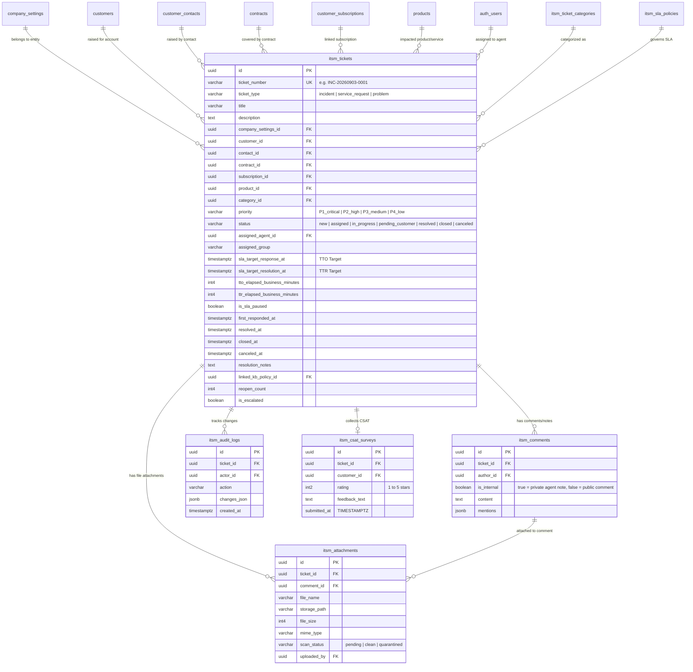
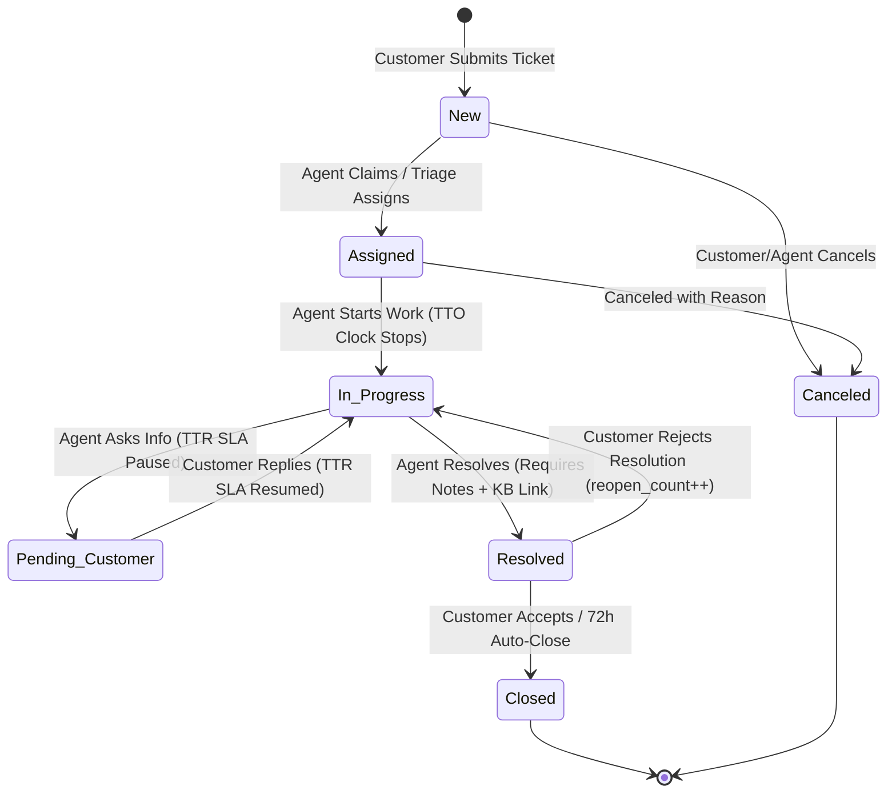

# ITSM Architecture & Implementation Blueprint — KDADKS Platform

> **Status**: Ready for Future Implementation  
> **Target Version**: KDADKS v2.0 ITSM Module  
> **Inspired By**: Combodo iTop ITIL Architecture & Business Hours SLA Engine  

---

## Executive Summary

This document serves as the comprehensive, authoritative technical blueprint for implementing the **Customer Service & IT Support Management (ITSM)** module within the **KDADKS** website and ERP/CRM system.

The module provides:
1. A **Customer Self-Service Portal** (`/portal/tickets`) for submitting, tracking, commenting on, and closing support tickets with automated CSAT collection, prominent **Assigned Customer ID** display, and integrated **Customer Contact Management** (reusing `CustomerContactModal.tsx`).
2. An **Administrative Agent Triage Desk & Operations Workflow** (`/admin/itsm/tickets` and Phase 2 unified `/itsm` route) featuring dual TTO/TTR SLA stopwatches, lifecycle state machine, private agent collaboration, KB/SOP integration, bulk operations, and escalation triggers.
3. Customer Self-Service access to account **Invoices & Payments** (`/portal/invoices`).
4. Full integration into the **Customer 360 Hub** (`Customer360Hub.tsx`) and multi-tenant entity isolation (`company_settings_id`).

---

## Key Business Rules & Architectural Scope

- **Assigned Customer ID & Contact Management**: Customer Portal prominently displays the customer's unique assigned **Customer Code / ID** (e.g. `IND-2026-0001` / `IRL-2026-0042`) and incorporates the existing `CustomerContactModal.tsx` workflow, allowing customers to view, add, edit, and set primary contact persons for their organization.
- **Customer Account Invoices & Payments**: Customer Portal provides a dedicated **Invoices** tab (`/portal/invoices`) allowing customers to view invoices issued to their account (`customer_id`), view payment status, download PDFs, and complete online checkouts.
- **Phase 2 Direct Unified `/itsm` Route**: Internal company staff and authorized support agents can access the ITSM triage desk and support portal directly via `/itsm` (verified via RBAC `useRolePermissions.ts` checking `ITSMTicketManagement`), separating internal agent workflows from customer self-service.
- **Email Notification Engine**: Deferred to **Phase 2**. Phase 1 uses real-time in-system toasts, badge counters, drawer alerts, and WebSocket notifications (`supabase.channel`).
- **SLA Business Hours Coverage**: SLA stopwatches calculate active minutes **strictly Mon-Fri 09:00 - 18:00 (IST/GMT based on company entity location)**. Stopwatch timers automatically **pause** during non-business hours, weekends, holidays, and when a ticket is in `pending_customer` state.
- **CMDB Asset & Service Catalog Mapping**: Tickets link directly to Customer Accounts (`customers`), Customer Contacts (`customer_contacts`), Contracts (`contracts`), Subscriptions (`customer_subscriptions`), and Products/Services (`products`).

---

## 1. System Architecture & Data Model

### 1.1 High-Level Architecture Workflow Diagram

```mermaid
graph TD
    subgraph Client Layer
        CP["Customer Self-Service Portal<br/>(/portal/tickets & /portal/invoices)"]
        AD["Agent Triage Desk<br/>(/admin/itsm/tickets)"]
        UP["Unified Company Internal Portal<br/>(/itsm - Phase 2)"]
        C360["Customer 360 Hub Integration<br/>(/admin/customer-360)"]
    end

    subgraph Security & Access Layer
        AUTH["Supabase Auth & Session"]
        RBAC["RBAC Engine (useRolePermissions)<br/>Modules: ITSMSupportPortal, ITSMTicketManagement, ITSMSLADefinitions"]
        RLS["PostgreSQL Row Level Security (RLS)<br/>company_settings_id & customer_id isolation"]
    end

    subgraph Service Layer (src/services/)
        TS["itsmTicketService.ts"]
        SLAS["itsmSlaService.ts (Mon-Fri 9-18 Business Hours)"]
        ATT["itsmAttachmentService.ts"]
        CSAT["itsmCsatService.ts"]
        CCM["customerContactService.ts (Reused)"]
        KB["policyService.ts (Knowledge Base / SOP Link)"]
        C360S["customer360Service.ts (Updated)"]
        NOTIF["In-App Toast Engine & Drawer Notifications"]
    end

    subgraph Database Layer (Supabase PostgreSQL)
        T_TICKETS["itsm_tickets"]
        T_COMMENTS["itsm_comments"]
        T_ATTACH["itsm_attachments"]
        T_SLAS["itsm_sla_policies"]
        T_AUDIT["itsm_audit_logs"]
        T_CSAT["itsm_csat_surveys"]
        T_SEQ["itsm_ticket_number_sequences"]
        T_CMDB["contracts, customer_subscriptions, products, customer_contacts"]
    end

    subgraph Storage & Realtime Channels
        BUCKET["Supabase Storage<br/>(bucket: 'itsm-attachments')"]
        REALTIME["Supabase Realtime WebSockets"]
    end

    CP --> AUTH
    AD --> AUTH
    UP --> AUTH
    C360 --> AUTH

    AUTH --> RBAC
    RBAC --> RLS

    RLS --> TS
    RLS --> SLAS
    RLS --> ATT
    RLS --> CSAT
    RLS --> CCM
    RLS --> KB

    TS --> T_TICKETS
    TS --> T_COMMENTS
    TS --> T_SEQ
    TS --> C360S
    TS --> T_CMDB
    CCM --> T_CMDB
    SLAS --> T_SLAS
    ATT --> T_ATTACH
    ATT --> BUCKET
    CSAT --> T_CSAT
    TS --> T_AUDIT

    TS --> REALTIME
    TS --> NOTIF
```

---

### 1.2 Core Entity Relationship Data Model (ERD)



---

### 1.3 Table Definitions (PostgreSQL / Supabase Migration)

```sql
-- Migration File: database/migrations/038_itsm_support_portal.sql

-- 1. ITSM Ticket Categories & SLA Defaults
CREATE TABLE IF NOT EXISTS itsm_ticket_categories (
  id UUID PRIMARY KEY DEFAULT gen_random_uuid(),
  company_settings_id UUID REFERENCES company_settings(id) ON DELETE CASCADE,
  name VARCHAR(100) NOT NULL,
  code VARCHAR(50) NOT NULL,
  description TEXT,
  parent_id UUID REFERENCES itsm_ticket_categories(id) ON DELETE SET NULL,
  default_priority VARCHAR(20) DEFAULT 'P3_medium',
  sla_response_hours_p1 INT DEFAULT 1,
  sla_resolution_hours_p1 INT DEFAULT 4,
  sla_response_hours_p2 INT DEFAULT 2,
  sla_resolution_hours_p2 INT DEFAULT 8,
  sla_response_hours_p3 INT DEFAULT 4,
  sla_resolution_hours_p3 INT DEFAULT 24,
  sla_response_hours_p4 INT DEFAULT 8,
  sla_resolution_hours_p4 INT DEFAULT 48,
  is_active BOOLEAN DEFAULT true,
  created_at TIMESTAMPTZ DEFAULT now(),
  updated_at TIMESTAMPTZ DEFAULT now()
);

-- 2. Core Tickets Table (Asset CMDB & SLA Stopwatch Columns)
CREATE TABLE IF NOT EXISTS itsm_tickets (
  id UUID PRIMARY KEY DEFAULT gen_random_uuid(),
  ticket_number VARCHAR(50) NOT NULL UNIQUE,
  ticket_type VARCHAR(30) NOT NULL CHECK (ticket_type IN ('incident', 'service_request', 'problem')),
  company_settings_id UUID REFERENCES company_settings(id) ON DELETE CASCADE,
  customer_id UUID REFERENCES customers(id) ON DELETE CASCADE,
  contact_id UUID REFERENCES customer_contacts(id) ON DELETE SET NULL,
  contract_id UUID REFERENCES contracts(id) ON DELETE SET NULL,
  subscription_id UUID REFERENCES customer_subscriptions(id) ON DELETE SET NULL,
  product_id UUID REFERENCES products(id) ON DELETE SET NULL,
  category_id UUID REFERENCES itsm_ticket_categories(id) ON DELETE SET NULL,
  title VARCHAR(255) NOT NULL,
  description TEXT NOT NULL,
  priority VARCHAR(20) NOT NULL DEFAULT 'P3_medium' CHECK (priority IN ('P1_critical', 'P2_high', 'P3_medium', 'P4_low')),
  status VARCHAR(30) NOT NULL DEFAULT 'new' CHECK (status IN ('new', 'assigned', 'in_progress', 'pending_customer', 'resolved', 'closed', 'canceled')),
  assigned_agent_id UUID REFERENCES auth.users(id) ON DELETE SET NULL,
  assigned_group VARCHAR(100),
  
  -- Dual SLA Stopwatches (Mon-Fri 09:00-18:00 Business Hours)
  sla_target_response_at TIMESTAMPTZ,   -- TTO Target Deadline (Time To Own)
  sla_target_resolution_at TIMESTAMPTZ, -- TTR Target Deadline (Time To Resolve)
  tto_elapsed_business_minutes INT DEFAULT 0,
  ttr_elapsed_business_minutes INT DEFAULT 0,
  is_sla_paused BOOLEAN DEFAULT false,
  
  first_responded_at TIMESTAMPTZ,
  resolved_at TIMESTAMPTZ,
  closed_at TIMESTAMPTZ,
  canceled_at TIMESTAMPTZ,
  cancellation_reason TEXT,
  resolution_notes TEXT,
  linked_kb_policy_id UUID REFERENCES policies(id) ON DELETE SET NULL,
  reopen_count INT DEFAULT 0,
  is_escalated BOOLEAN DEFAULT false,
  created_by UUID REFERENCES auth.users(id) ON DELETE SET NULL,
  created_at TIMESTAMPTZ DEFAULT now(),
  updated_at TIMESTAMPTZ DEFAULT now()
);

-- 3. Ticket Comments & Private Agent Notes
CREATE TABLE IF NOT EXISTS itsm_comments (
  id UUID PRIMARY KEY DEFAULT gen_random_uuid(),
  ticket_id UUID NOT NULL REFERENCES itsm_tickets(id) ON DELETE CASCADE,
  author_id UUID NOT NULL REFERENCES auth.users(id) ON DELETE CASCADE,
  is_internal BOOLEAN NOT NULL DEFAULT false, -- true = private agent note; false = public comment
  content TEXT NOT NULL,
  mentions JSONB DEFAULT '[]'::jsonb,
  created_at TIMESTAMPTZ DEFAULT now(),
  updated_at TIMESTAMPTZ DEFAULT now()
);

-- 4. Multi-File Attachments Metadata
CREATE TABLE IF NOT EXISTS itsm_attachments (
  id UUID PRIMARY KEY DEFAULT gen_random_uuid(),
  ticket_id UUID NOT NULL REFERENCES itsm_tickets(id) ON DELETE CASCADE,
  comment_id UUID REFERENCES itsm_comments(id) ON DELETE CASCADE,
  file_name VARCHAR(255) NOT NULL,
  storage_path TEXT NOT NULL,
  file_size INT NOT NULL,
  mime_type VARCHAR(100) NOT NULL,
  scan_status VARCHAR(30) DEFAULT 'clean' CHECK (scan_status IN ('pending', 'clean', 'quarantined')),
  uploaded_by UUID REFERENCES auth.users(id) ON DELETE SET NULL,
  created_at TIMESTAMPTZ DEFAULT now()
);

-- 5. Audit Logging for Ticket Lifecycle
CREATE TABLE IF NOT EXISTS itsm_audit_logs (
  id UUID PRIMARY KEY DEFAULT gen_random_uuid(),
  ticket_id UUID NOT NULL REFERENCES itsm_tickets(id) ON DELETE CASCADE,
  actor_id UUID REFERENCES auth.users(id) ON DELETE SET NULL,
  action VARCHAR(50) NOT NULL,
  changes_json JSONB NOT NULL DEFAULT '{}'::jsonb,
  created_at TIMESTAMPTZ DEFAULT now()
);

-- 6. CSAT Satisfaction Feedback Surveys
CREATE TABLE IF NOT EXISTS itsm_csat_surveys (
  id UUID PRIMARY KEY DEFAULT gen_random_uuid(),
  ticket_id UUID NOT NULL UNIQUE REFERENCES itsm_tickets(id) ON DELETE CASCADE,
  customer_id UUID NOT NULL REFERENCES customers(id) ON DELETE CASCADE,
  contact_id UUID REFERENCES customer_contacts(id) ON DELETE SET NULL,
  rating INT2 NOT NULL CHECK (rating BETWEEN 1 AND 5),
  feedback_text TEXT,
  submitted_at TIMESTAMPTZ DEFAULT now()
);
```

---

### 1.4 Mon-Fri 09:00 - 18:00 Business Hours SLA Calculator

```sql
CREATE OR REPLACE FUNCTION calculate_business_deadline(
  p_start_time TIMESTAMPTZ,
  p_business_hours INT,
  p_timezone TEXT DEFAULT 'Asia/Kolkata'
)
RETURNS TIMESTAMPTZ AS $$
DECLARE
  curr_time TIMESTAMPTZ;
  remaining_minutes INT;
  day_of_week INT;
  work_start TIMESTAMPTZ;
  work_end TIMESTAMPTZ;
  available_today_minutes INT;
BEGIN
  curr_time := p_start_time;
  remaining_minutes := p_business_hours * 60;

  WHILE remaining_minutes > 0 LOOP
    day_of_week := EXTRACT(DOW FROM curr_time AT TIME ZONE p_timezone);

    -- Skip Saturdays (6) and Sundays (0)
    IF day_of_week = 0 OR day_of_week = 6 THEN
      curr_time := (DATE_TRUNC('day', curr_time AT TIME ZONE p_timezone) + INTERVAL '1 day' + INTERVAL '9 hours') AT TIME ZONE p_timezone;
      CONTINUE;
    END IF;

    work_start := (DATE_TRUNC('day', curr_time AT TIME ZONE p_timezone) + INTERVAL '9 hours') AT TIME ZONE p_timezone;
    work_end := (DATE_TRUNC('day', curr_time AT TIME ZONE p_timezone) + INTERVAL '18 hours') AT TIME ZONE p_timezone;

    IF curr_time < work_start THEN
      curr_time := work_start;
    ELSIF curr_time >= work_end THEN
      curr_time := (DATE_TRUNC('day', curr_time AT TIME ZONE p_timezone) + INTERVAL '1 day' + INTERVAL '9 hours') AT TIME ZONE p_timezone;
      CONTINUE;
    END IF;

    available_today_minutes := EXTRACT(EPOCH FROM (work_end - curr_time)) / 60;

    IF remaining_minutes <= available_today_minutes THEN
      curr_time := curr_time + (remaining_minutes || ' minutes')::INTERVAL;
      remaining_minutes := 0;
    ELSE
      remaining_minutes := remaining_minutes - available_today_minutes;
      curr_time := (DATE_TRUNC('day', curr_time AT TIME ZONE p_timezone) + INTERVAL '1 day' + INTERVAL '9 hours') AT TIME ZONE p_timezone;
    END IF;
  END LOOP;

  RETURN curr_time;
END;
$$ LANGUAGE plpgsql;
```

---

### 1.5 Atomic Unique Ticket Number Sequence Generator

```sql
CREATE TABLE IF NOT EXISTS itsm_ticket_number_sequences (
  key VARCHAR(100) PRIMARY KEY,
  current_val INT NOT NULL DEFAULT 0,
  updated_at TIMESTAMPTZ NOT NULL DEFAULT now()
);

CREATE OR REPLACE FUNCTION get_next_itsm_ticket_number(
  p_ticket_type TEXT DEFAULT 'incident'
)
RETURNS TEXT AS $$
DECLARE
  prefix_code TEXT;
  date_str TEXT;
  seq_key TEXT;
  next_val INT;
  formatted_number TEXT;
BEGIN
  IF LOWER(p_ticket_type) = 'service_request' THEN
    prefix_code := 'REQ';
  ELSIF LOWER(p_ticket_type) = 'problem' THEN
    prefix_code := 'PRB';
  ELSE
    prefix_code := 'INC';
  END IF;

  date_str := TO_CHAR(CURRENT_DATE, 'YYYYMMDD');
  seq_key := prefix_code || '/' || date_str;

  INSERT INTO itsm_ticket_number_sequences (key, current_val, updated_at)
  VALUES (seq_key, 1, now())
  ON CONFLICT (key) DO UPDATE
  SET current_val = itsm_ticket_number_sequences.current_val + 1,
      updated_at = now()
  RETURNING current_val INTO next_val;

  formatted_number := prefix_code || '-' || date_str || '-' || LPAD(next_val::TEXT, 4, '0');
  RETURN formatted_number;
END;
$$ LANGUAGE plpgsql;
```

---

## 2. Customer Portal Specifications (`/portal/tickets` & `/portal/invoices`)

### 2.1 Secure Authentication & Multi-Tenant RLS Scope
- **Authentication**: Customers log in securely via Supabase Auth.
- **Tenant Scope Enforcement**: Row Level Security (RLS) policies strictly enforce multi-tenant data isolation, restricting customer users to viewing and interacting *only* with tickets and invoices where `customer_id = auth_user.customer_id`.
- **Customer Roles**: `customer_user` (interact with own account tickets) & `customer_admin` (view/manage all account tickets and contacts).

### 2.2 Assigned Customer ID & Company Profile Display
- **Prominent Header Banner**: Displays the logged-in customer's official Company Name and unique assigned **Customer ID / Customer Code** (e.g. `IND-2026-0001` or `IRL-2026-0042`).
- **Integrated Contact Management Workflow**:
  - Customer Portal provides a **"Manage Contact Persons"** button in the header/navigation.
  - Directly reuses and renders the existing **`CustomerContactModal.tsx`** component (`src/components/customer/CustomerContactModal.tsx`) and `customerContactService.ts`.
  - Customers can view all contact persons associated with their account, add new contact persons (Name, Email, Phone, Job Title, Role), edit existing contact details, and set primary contact designations for their organization.

### 2.3 Ticket Submission & Rich Text Interface
- **Rich Text Editor**: TinyMCE rich text area with inline image uploads, code blocks, and structured steps-to-reproduce.
- **Dynamic Prioritization Matrix**: Impact (Org / Team / User) × Urgency (Stopped / Degraded / Inquiry) → `P1_critical` .. `P4_low`.
- **Multi-File Attachments & Security Scanning**:
  - Accepts logs (`.log`, `.txt`), documents (`.pdf`, `.docx`), images (`.png`, `.jpg`), and archives (`.zip`) up to 25 MB per file.
  - Client-side MIME validation & server-side magic byte inspection (`scan_status`: `pending`, `clean`, `quarantined`).

### 2.4 Real-Time Status Tracking & Interactive Features
- **Live Status Feed**: Live WebSocket updates via Supabase Realtime (`supabase.channel('itsm_tickets')`).
- **Bidirectional Commenting**: Customer receives instant timeline updates when agents reply and can post public follow-ups.
- **Ticket Self-Cancellation**: Customers can self-cancel open tickets with a mandatory cancellation reason.

### 2.5 Resolution Sign-off & Automated CSAT Survey
- **Formal Customer Sign-Off**: Agent sets status to `resolved` → Customer gets a 72-hour window to click **[ Accept Resolution & Close ]** or **[ Reject Resolution & Reopen ]**.
- **Automated CSAT Survey**: Accepting resolution opens an interactive 5-star rating widget with text feedback saved to `itsm_csat_surveys`.

### 2.6 Customer Account Invoices & Payments Portal (`/portal/invoices`)
- Dedicated **Invoices** tab fetching all invoices issued to the customer account (`customer_id = auth_user.customer_id`).
- Displays invoice status badges (`paid`, `sent`, `partially_paid`, `overdue`), PDF downloads (`invoiceService.generateInvoicePDF`), and online payment checkout (Stripe / PayPal).

---

## 3. Administrative Agent Operations & Triage Workflow (`/admin/itsm/tickets` & `/itsm`)

The Administrative Triage Desk provides IT service agents, triage managers, and support leads with a high-density, real-time command center for ticket queue management, SLA enforcement, collaboration, and ticket lifecycle execution.

### 3.1 Centralized Triage Desk UI Layout & Queue Filters

- **Navigation Integration**: Linked in `SimpleAdminDashboard.tsx` sidebar under **HR & Operations / Service Desk**.
- **Phase 2 Direct Unified `/itsm` Portal Route**:
  - Company internal staff and support agents can navigate directly to `/itsm` (or `/itsm/tickets`).
  - Access is restricted to authorized company employees via `useRolePermissions.ts` checking the `ITSMTicketManagement` module permissions.
  - Provides a clean, dedicated workspace for internal team members without requiring navigation through the main admin sidebar.

- **Executive KPI Header Cards**:
  - `Total Open Tickets`: Count of active non-closed tickets for selected company entity.
  - `Unassigned Triage Queue`: Tickets in `new` state awaiting initial agent assignment.
  - `SLA Breached / Nearing Breach`: Tickets with < 25% or < 0 business minutes remaining on TTO/TTR deadlines.
  - `Average CSAT Rating`: Live entity satisfaction score (e.g. 4.8 / 5.0 ⭐).

- **Queue View Tabs**:
  - `Unassigned Triage`: Open tickets requiring assignment.
  - `My Assigned`: Tickets assigned to the current logged-in agent.
  - `P1/P2 Critical`: High-severity incidents requiring urgent resolution.
  - `SLA Breaching Soon`: Stopwatches approaching deadline within 60 business minutes.
  - `Pending Customer`: Tickets paused while awaiting customer feedback.
  - `Resolved / Pending Sign-off`: Tickets awaiting customer acknowledgment or 72-hour auto-close.
  - `All Entity Tickets`: Full multi-tenant queue across selected `company_settings_id`.

- **Multi-Parameter Search & Filtering Bar**:
  - Multi-select dropdowns for **Company Entity**, **Customer Account**, **Covered Contract**, **Category**, **Priority**, **Status**, and **Assigned Agent**.
  - Text search indexing ticket number, title, customer name, and description content.

- **Dynamic TTO & TTR SLA Countdown Chips**:
  - Displays dual stopwatch badges on every ticket queue row:
    - **TTO (Time To Own / Initial Response)**: Measures time from creation to first agent response (`first_responded_at`).
    - **TTR (Time To Resolve)**: Measures time from creation to resolution (`resolved_at`).
    - 🟢 **Green**: > 50% business hours SLA remaining.
    - 🟡 **Yellow**: < 25% business hours SLA remaining (Warning).
    - 🔴 **Red (Blinking)**: SLA Breached! (< 0 minutes remaining).
    - ⏸️ **Grey (Paused)**: Stopwatch paused while status is `pending_customer`.

- **Multi-Select Bulk Operations Toolbar**:
  - Checkbox selection on ticket table enables bulk execution:
    - **Bulk Assign Agent**: Assign selected tickets to an agent or support group.
    - **Bulk Reassign Category**: Change ticket category and re-apply default category SLAs.
    - **Bulk Priority Override**: Adjust priority with mandatory reason.
    - **Bulk Status Transition**: Batch move tickets (e.g., set multiple tickets to `in_progress`).

---

### 3.2 Configurable Lifecycle State Machine & Transition Rules



#### Detailed State Transition Matrix & Guard Rules:

| Current State | Target State | Triggering User Role | Mandatory Validation Guard Checks | SLA Stopwatch Action |
|---|---|---|---|---|
| `new` | `assigned` | Support Agent / Triage Manager | Must select `assigned_agent_id` or `assigned_group`. | TTO Stopwatch continues running until initial agent reply. |
| `new` | `canceled` | Customer / Admin | Must enter `cancellation_reason`. | Stopwatches stopped. Sets `canceled_at`. |
| `assigned` | `in_progress` | Assigned Agent | First agent public response or explicit "Start Work" action. | Sets `first_responded_at`. **TTO Stopwatch completed successfully.** |
| `in_progress` | `pending_customer` | Assigned Agent | Agent posts public comment asking customer for information. | **TTR Stopwatch PAUSED** (`is_sla_paused = true`). |
| `pending_customer` | `in_progress` | Customer / Agent | Customer posts public reply comment. | **TTR Stopwatch RESUMED** (`is_sla_paused = false`). |
| `in_progress` | `resolved` | Assigned Agent | **Resolution Notes** (min 20 chars) mandatory. Option to link Knowledge Base SOP (`linked_kb_policy_id`). | **TTR Stopwatch COMPLETED.** Sets `resolved_at` & starts 72h customer sign-off window. |
| `resolved` | `closed` | Customer / System Job | Customer clicks "Accept Resolution" or automated 72-hour inactivity timer expires. | Sets `closed_at`. Triggers CSAT survey prompt. |
| `resolved` | `in_progress` | Customer | Customer clicks "Reject Resolution" with feedback text. | Auto-increments `reopen_count`. Resumes TTR Stopwatch. |

---

### 3.3 Agent Assignment Rules & Workload Balancing

1. **Manual Triage Modal**: Triage manager opens ticket, selects target agent from dropdown sorted by current active ticket count.
2. **Category Skill Routing**: Tickets created in specific categories (e.g. `NETWORKING_INFRA`) auto-route to designated support group (e.g. *Infrastructure Team*).
3. **Agent Workload Protection**: System warns triage managers if an agent already has > 15 active `in_progress` tickets.

---

### 3.4 Internal Collaboration & Knowledge Base Integration

- **Dual-Mode Commenting Component**:
  - **Public Customer Reply**: Visible in Customer Portal, updates timeline.
  - **Private Agent Note**: Marked `is_internal = true` with a bright yellow background and padlock icon. **Strictly hidden from Customer Portal** and excluded from RLS policies for non-agent users.
- **Team @Mentions**: Typing `@agent_name` inside internal notes auto-suggests team members and dispatches an instant in-app drawer notification to the tagged colleague.
- **One-Click Knowledge Base / SOP Linking**:
  - When resolving a ticket, agents can search and attach existing company SOPs and policies (`policies` table from migration `035_policy_sop_management.sql`).
  - Stores `linked_kb_policy_id` on the ticket record for future reference and AI knowledge training.

---

### 3.5 Automated Escalation Triggers

- **Level 1 (Unassigned P1 Alert)**: If a `P1_critical` ticket remains in `new` state for > 15 business minutes without an assigned agent, the system sets `is_escalated = true` and displays an urgent banner on the Triage Desk.
- **Level 2 (SLA Breach Escalation)**: When TTO or TTR business hours remaining drops below 0 minutes, the ticket row badge turns blinking red, logs an audit entry in `itsm_audit_logs`, and flags the ticket for Support Manager review.

---

## 4. Implementation Phasing & Route Blueprint

```
Phase 1 (Core Customer & Triage Engine):
├── Customer Portal (/portal/tickets)
│   ├── Assigned Customer Code Display (e.g. IND-2026-0001)
│   ├── Customer Contact Management (reusing CustomerContactModal.tsx)
│   ├── Ticket Submission (TinyMCE, Priority Matrix, Multi-file Uploads)
│   └── Real-time Status Tracking, Bidirectional Comments & CSAT Survey
└── Administrative Triage Desk (/admin/itsm/tickets)
    ├── Queue Triage Desk & Multi-column Filters
    ├── Dual Mon-Fri 09:00-18:00 TTO/TTR SLA Stopwatches
    ├── Private Agent Notes & Team @Mentions
    └── One-Click KB / SOP Linking (policies table)

Phase 2 (Expanded Unified Portal, Customer Invoices & Email Integration):
├── Unified Company Internal Portal (/itsm)
│   ├── Direct route for authorized company employees (RBAC ITSMTicketManagement)
│   └── High-density agent desk without full admin sidebar overhead
├── Customer Portal Invoices Module (/portal/invoices)
│   ├── Account Invoice Listing, Status Badges & PDF Downloads
│   └── Online Stripe / PayPal Checkout Integration
└── Email Notification & Webhook Engine
    ├── Transactional email alerts via Resend API (emailService.ts)
    └── Direct inbound email-to-ticket creation webhooks
```

---

## 5. Proposed File Additions for Implementation

| Path | Description |
|---|---|
| `database/migrations/038_itsm_support_portal.sql` | PostgreSQL schema, SLA business hours function, sequence RPC & RLS policies |
| `src/types/itsm.ts` | TypeScript types for tickets, comments, categories, CSAT, audit logs, SLA stopwatches |
| `src/services/itsmTicketService.ts` | Service layer CRUD for tickets, comments, state machine transitions, triage filters |
| `src/services/itsmSlaService.ts` | Mon-Fri 09:00 - 18:00 business hours SLA calculator & stopwatch pause/resume engine |
| `src/components/itsm/CustomerPortal.tsx` | Customer self-service support ticket & invoice portal (`/portal/*`) |
| `src/components/itsm/AgentTriageDesk.tsx` | Admin support triage desk & ticket queue manager (`/admin/itsm/tickets` and `/itsm`) |
| `src/components/itsm/TicketDetailModal.tsx` | Ticket workspace viewer with timeline, private agent notes, attachments & KB link |
| `src/components/itsm/CSATModal.tsx` | Interactive 5-star customer feedback survey modal |
| `src/components/customer/CustomerContactModal.tsx` | Reused existing modal for customer self-service contact person additions/edits |
| `src/components/customer/Customer360Hub.tsx` | Updated with "Support Tickets" operational tab |

---

## 6. Verification & Testing Strategy

Run linting and build validation after file creation:
```bash
npm run lint
npm run build
```
