# reCAPTCHA Development Configuration Guide

## Issue Resolution: "reCAPTCHA verification failed"

The error occurs because Google reCAPTCHA Enterprise requires proper authentication for server-side verification. Here's how to resolve it:

## Quick Fix for Development

### 1. Environment Configuration
The `.env` file has been updated with development-friendly settings:

```bash
# Development Mode Configuration
NODE_ENV=development
GOOGLE_CLOUD_PROJECT_ID=kdadks-service-p-1755602644470

# Your existing reCAPTCHA keys
VITE_RECAPTCHA_SITE_KEY=6LdQV6srAAAAADPSVG-sDb2o2Mv3pJqYhr6QZa9r
VITE_RECAPTCHA_SECRET_KEY=6LdQV6srAAAAAO79W16J3y7jCS6LOFkdQrlQ-6fm
```

### 2. Development Bypass Logic
The `api/send-email.cjs` now includes smart fallback logic:

```javascript
// In development without proper Google Cloud setup, allow with warning
if (!isProduction && !hasGoogleCredentials) {
  console.log('⚠️ Development mode: reCAPTCHA verification bypassed (no Google Cloud credentials)');
  return { success: true, bypass: true, score: 0.9 };
}
```

### 3. Testing the Fix

1. **Restart the Development Server**:
   ```bash
   npm run dev
   ```

2. **Test Any Form**:
   - Navigate to Customer Support, Contact, or any form
   - Fill out the form and submit
   - Should now work without reCAPTCHA errors

3. **Check Console Logs**:
   - Look for: "⚠️ Development mode: reCAPTCHA verification bypassed"
   - This confirms the bypass is working

## Production Configuration

For production deployment, you'll need:

### 1. Google Cloud Service Account
```bash
# Create service account in Google Cloud Console
# Download JSON key file
# Set environment variable:
GOOGLE_APPLICATION_CREDENTIALS=/path/to/service-account-key.json
```

### 2. Production Environment Variables
```bash
NODE_ENV=production
GOOGLE_CLOUD_PROJECT_ID=kdadks-service-p-1755602644470
GOOGLE_APPLICATION_CREDENTIALS=/path/to/credentials.json
```

### 3. Netlify Deployment
For Netlify, add these environment variables in the dashboard:
- `NODE_ENV=production`
- `GOOGLE_CLOUD_PROJECT_ID=kdadks-service-p-1755602644470`
- Upload the service account JSON as a file or use build secrets

## How the Fallback System Works

```mermaid
graph TD
    A[Form Submission] --> B[Check Environment]
    B --> C{Production Mode?}
    C -->|No| D[Development Bypass]
    C -->|Yes| E{Google Credentials?}
    E -->|No| F[Standard reCAPTCHA]
    E -->|Yes| G[Enterprise Assessment]
    D --> H[✅ Allow Submission]
    F --> I{Valid Token?}
    G --> J{Score >= 0.3?}
    I -->|Yes| H
    I -->|No| K[❌ Block Submission]
    J -->|Yes| H
    J -->|No| K
```



## Verification Hierarchy

1. **Enterprise with Google Cloud**: Full ML-based risk assessment
2. **Standard reCAPTCHA**: Basic token verification
3. **Development Bypass**: Allow all submissions with warning

## Current Status

✅ **Development**: Working with bypass mode  
🔄 **Production**: Requires Google Cloud service account setup  
✅ **Forms**: All 5 forms updated with Enterprise components  
✅ **Fallbacks**: Multiple verification methods implemented  

## Next Steps

1. **Immediate**: Test forms in development (should work now)
2. **Production**: Set up Google Cloud service account
3. **Monitoring**: Check console logs for verification status
4. **Optimization**: Adjust score thresholds based on traffic

---
**Updated**: 2025-08-19  
**Status**: ✅ Development Issue Resolved
